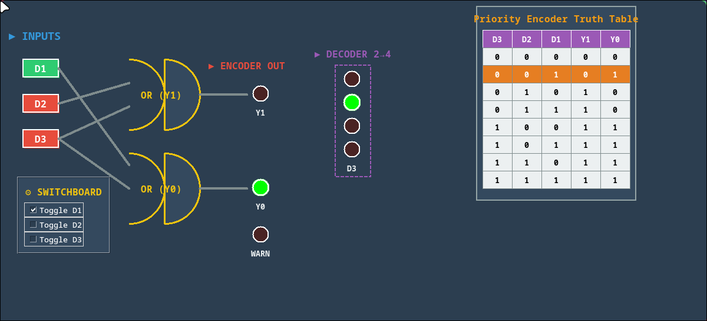
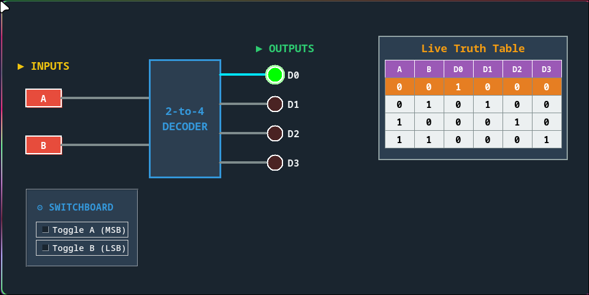

# 🧠 مدار منطقی دیجیتال – Encoder و Decoder

## 📌 معرفی پروژه
این مخزن شامل پیاده‌سازی و شبیه‌سازی مدارهای منطقی دیجیتال با تمرکز بر **Encoder (کدگذار)** و **Decoder (کدگشا)** است.

هدف پروژه، درک عمیق‌تر رفتار مدارهای منطقی، شبیه‌سازی سخت‌افزاری در محیط لینوکس، و نمایش گرافیکی عملکرد مدار به‌صورت زنده می‌باشد.

تمامی اجزای این پروژه به‌صورت **آفلاین** و با تکیه بر ابزارهای **متن‌باز (Open-Source)** توسعه داده شده‌اند تا نشان دهد حتی بدون دسترسی به ابزارهای آنلاین هم می‌توان پروژه‌های مهندسی کامل و استاندارد پیاده‌سازی کرد.

---

## 🖼️ نمودارها و تصاویر مدار

### مدار کدگذار ۴ به ۲



### مدار کدگشا ۲ به ۴



### موج شبیه‌سازی (Waveform)


---

## ⚙️ ابزارها و تکنولوژی‌های استفاده‌شده

- **Verilog HDL** – طراحی مدار دیجیتال  
- **Icarus Verilog (iverilog)** – شبیه‌سازی مدار  
- **GTKWave** – مشاهده سیگنال‌ها و موج خروجی  
- **Python + Tkinter** – شبیه‌ساز گرافیکی آفلاین  
- **Git & GitHub** – کنترل نسخه و مستندسازی

تمام ابزارهای بالا آزاد، رایگان و در مخازن اصلی لینوکس در دسترس هستند.

---

## 🧩 اجزای پیاده‌سازی‌شده

✅ **Encoder چهار به دو (4-to-2)**  
تبدیل یکی از چهار ورودی فعال به خروجی دودویی ۲ بیتی  

✅ **Priority Encoder (کدگذار اولویتی)**  
در صورت فعال بودن چند ورودی، ورودی با اولویت بالاتر انتخاب می‌شود  

✅ **Decoder دو به چهار (2-to-4)**  
بازگردانی خروجی دودویی Encoder به خروجی‌های مجزا  

✅ **تشخیص خطا (Error Detection)**  
بررسی فعال بودن همزمان چند ورودی غیرمجاز  

✅ **شبیه‌ساز گرافیکی تعاملی (Interactive GUI)**  
نمایش وضعیت مدار شامل:
- کلیدها (Switch)
- سیم‌های فعال (Animated Wires)
- گیت‌ها و LED خروجی
- جدول درستی (Truth Table) زنده و تعاملی

---

## 📂 ساختار پروژه

```
.
├── encoder.v            # پیاده‌سازی Encoder در Verilog
├── tb_encoder.v         # فایل Testbench برای شبیه‌سازی
├── encoder.vvp          # فایل اجرایی شبیه‌سازی (خروجی iVerilog)
├── encoder.vcd          # فایل Waveform برای مشاهده در GTKWave
├── encoder.py           # نسخه ساده شبیه‌سازی منطقی با Python
├── encoder_gui.py       # شبیه‌ساز گرافیکی (Tkinter)
├── images/              # تصاویر و نمودارها
│   ├── encoder_diagram.png
│   ├── decoder_diagram.png
│   └── waveform.png
└── README.md
```

---

## ▶️ اجرای شبیه‌سازی Verilog

دستورهای زیر را در ترمینال لینوکس اجرا کنید:

```bash
iverilog encoder.v tb_encoder.v -o encoder.vvp
vvp encoder.vvp
```

سپس برای مشاهده‌ی خروجی سیگنال‌ها:

```bash
gtkwave encoder.vcd
```

---

## ▶️ اجرای شبیه‌ساز گرافیکی Python

کافی‌ست اجرا کنید:

```bash
python encoder_gui.py
```

✅ بدون نیاز به نصب هیچ کتابخانه‌ی اضافی!

---

## 🎓 هدف آموزشی

این پروژه برای درس **مدار منطقی / سیستم‌های دیجیتال** طراحی شده و اهداف آن شامل موارد زیر است:

- درک عملی عملکرد Encoder و Decoder  
- مشاهده رفتار مدار در حالت‌های مختلف  
- آشنایی با شبیه‌سازی سخت‌افزاری با Verilog  
- ترکیب نمایش سخت‌افزاری با شبیه‌ساز گرافیکی Python  

---

## ✅ نتیجه‌گیری

> این پروژه نشان می‌دهد که حتی در شرایط محدودیت شبکه، با تکیه بر سیستم‌عامل لینوکس و ابزارهای متن‌باز، می‌توان پروژه‌های مهندسی استاندارد، کامل و قابل ارائه طراحی و اجرا کرد.  

---

## 👨‍💻 توسعه‌دهنده

**محسن تقی‌پور**    
---

